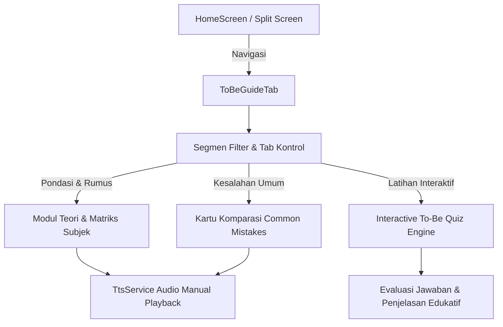

# Perencanaan Fitur: Belajar To Be (Mastering 'To Be')

Dokumen spesifikasi arsitektur dan perencanaan fitur pembelajaran khusus *To Be* (am, is, are, was, were, been, being) pada aplikasi Flutter Belajar Bahasa Inggris.

---

## 1. Latar Belakang & Masalah Pengguna
Pembelajar bahasa Inggris pemula sering kali mengalami kebingungan mendasar mengenai penggunaan *To Be*, terutama:
- Kapan harus menggunakan *to be* dan kapan tidak boleh menggunakan *to be* (konsep kalimat nominal vs verbal).
- Kesalahan umum seperti "*I am agree*" (seharusnya "*I agree*") atau "*I am eat bread*" (seharusnya "*I eat bread*" atau "*I am eating bread*").
- Ketepatan memilih to be berdasarkan subjek (*I, you, we, they, he, she, it*, singular/plural noun) dan dimensi waktu (*Present, Past, Perfect, Continuous*).

---

## 2. Struktur Modul & Konten Pembelajaran

Modul *Belajar To Be* dirancang dalam 4 segmen terpadu:
1. **Pondasi Dasar & Aturan Emas:**
   - Kalimat Nominal vs Verbal.
   - Formula ANA (*Adjective, Noun, Adverb*).
2. **Matriks Subjek & Dimensi Waktu:**
   - Present (*am, is, are*)
   - Past (*was, were*)
   - Perfect (*been*)
   - Continuous & Passive (*being*)
3. **Analisis Kesalahan Umum (Common Mistakes):**
   - Komparasi salah vs benar dengan penjelasan alasan dalam Bahasa Indonesia.
4. **Latihan Interaktif To Be (Interactive Practice):**
   - Soal kuis khusus *fill-in-the-blank* dengan umpan balik langsung dan audio pelafalan manual (tanpa auto-play).

---

## 3. Diagram Alur & Arsitektur Sistem (Mermaid)

---

## 4. Lokasi Implementasi Kode (Code Locations)

- `lib/models/to_be_lesson.dart`: Model data untuk materi teori, contoh kalimat, aturan pasangan subjek, dan bank soal latihan To Be.
- `lib/screens/tabs/to_be_guide_tab.dart`: Tampilan antarmuka utama (responsif mobile & desktop, filter segmen materi, pemutar audio manual, dan kuis interaktif).
- `lib/screens/home_screen.dart`:
  - `home_screen.dart:49`: Penambahan meta fitur `'to_be'` pada `_featureMeta`.
  - `home_screen.dart:167`: Penambahan routing widget `'to_be'` pada `_getFeatureWidget()`.
  - `home_screen.dart:250`: Penambahan tombol tab 'Belajar To Be' pada `_buildTopNavigationBar()`.
- `test/to_be_guide_test.dart`: Unit & widget test untuk validasi model pelajaran To Be dan engine evaluasi kuis To Be.

---

## 5. Invarian & Standar Kualitas
- **Audio TTS Manual-Only:** Suara hanya berputar ketika tombol speaker ditekan secara eksplisit.
- **Tampilan Vertikal Responsif:** Menghindari tabel horizontal lebar yang sulit dibaca di layar mobile.
- **Kesesuaian Split Screen:** Kompatibel penuh saat dibuka dalam mode multi-pane split screen.
- **Quality Gates:** Bebas linter warning (`flutter analyze`) dan 100% test lulus (`flutter test`).
